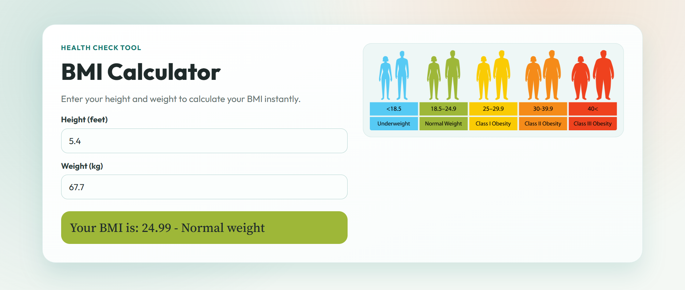

# BMI Calculator

BMI (Body Mass Index) calculator application.

Below is a preview of the BMI Calculator application:



## Features

- Input height and weight
- Calculates BMI instantly
- Displays BMI category (Underweight, Normal, Overweight, Obese)

## Getting Started

1. Clone the repository:
    ```bash
    git clone https://github.com/yourusername/bmi-calculator.git
    ```
2. Install dependencies:
    ```bash
    npm install
    ```
3. Run the application:
    ```bash
    npm start
    ```

## Usage

1. Enter your height (in feet) and weight (in kg).
2. Click "Calculate".
3. View your BMI and category.

## License

This project is licensed under the MIT License.